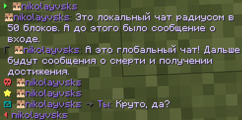
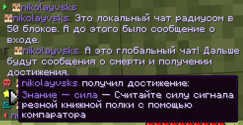
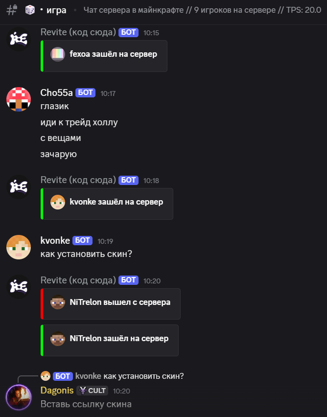

# Текстовый и Голосовой чат

## Текстовый чат

### Локальный и Глобальный канал

Как и везде, чат разделён на два канала: Локальный и Глобальный.

Сообщения в локальном чате не требуют префикса и отправляются всем игрокам радусом в 50 блоков (если игроков в этом радиусе нет, вы получите уведомление).

Сообщения в глобальный чат отправляются только если перед ними стоит `!`. Сообщения в глобальном чате видны всем игрокам, кроме тех, у кого глобальный чат выключен.

### Единый стиль

Весь чат выполнен в едином стиле с фокусом на никнейм игроков и их сообщения. Типы сообщений разделяются разными иконками со своими цветами.&#x20;

Подробная информация скрыта за иконками. К-примеру, чтобы получить информацию о достижении, которое получил игрок, достаточно навести мышку на иконку звёздочки.

<figure><figcaption>
Чат в игре
</figcaption></figure> <figure><figcaption>
Информация о достижении
</figcaption></figure>

### Настройки чата

С помощью `/settings` вы можете открыть настройки своего чата, в которых можно:

* Включить или выключить сообщения о смертях, достижениях, входах и выходах;
* Включить или выключить глобальный чат (писать в глобальный чат тоже не получится, если он выключен);\
  Люди с выключенным глобальным чатом помечаются красным флажком после ника в ТАБе.
* Выбрать цветовое оформление чата: Фиолетовое (стоит по умолчанию), Красное, Синее, Зелёное и Белое.

<figure><figcaption>
Настройки чата
</figcaption></figure> <figure><figcaption>
Выбор цвета чата
</figcaption></figure>

### Синхронизация с Discord

Вы можете просматривать чат Minecraft в канале #игра в нашем Discord, а также отправлять сообщения из канала Discord в чат Minecraft. Сообщения, которые отправляются из Discord в Minecraft помечаются синим префиксом «ДС».

Можно ввести `playerlist` для просмотра списка игроков, которые находятся на сервере.

Поддерживает стили чата и отключается вместе с глобальным чатом.

<figure><figcaption>
Канал #игра с чатом Minecraft
</figcaption></figure>

### Модули и команды

`/ignore` — скрыть сообщения от игрока и заглушить его в Голосовом чате.

`/ignorelist` — список игроков, которые находятся у вас в игноре.

`%coords%` — вставить ваши координаты.

`%item%` — показать свой предмет.

## Голосовой чат

### Установка

Для использования голосового чата вам нужно установить мод [PlasmoVoice](https://modrinth.com/plugin/plasmo-voice/versions). Это необязательно, но мы рекомендуем сделать это.\
_Также рекомендуем взглянуть на_ [_**TalkingHeads**_](https://modrinth.com/mod/talkingheads) _— мод увеличивает головы игроков, когда они разговаривают._

### Настройка мода

Нажав на `V` (клавишу можно поменять в настройках управления), вы можете открыть настройки мода. Вот на что стоит обратить внимание:

* В разделе «Активация» настройте удобный вам тип активации.
* В разделе «Громкость» отрегулируйте комфортную для себя громкость.\
  Небольшой лайфхак: если смотреть на игрока и удерживать ПКМ, можно регулировать его громкость в PlasmoVoice.
* В разделе «Устройства» проверьте микрофон, его громкость и порог активаици.
* В разделе «Оверлей» можно настроить оверлей, чтобы нагляднее видеть кто разговаривает.

### Группы

С помощью `/groups` вы можете создавать, присоединиться и управлять группами в PlasmoVoice. Вот самый простой способ использования:

1. Кто-то создаёт группу с помощью `/groups create`.
2. Создатель группы приглашает своих друзей с помощью `/groups invite`.&#x20;
3. Друзья принимают приглашение в чате.

На этом всё. Теперь вы сможете использовать голосовой чат на неограниченном расстоянии. Более того, с помощью `/groups set persistent true` можно сделать сохранение группы несмотря на выходы участников или перезагрузки сервера.

Настроить интерфейс или активацию можно через настройки PlasmoVoice.

### Пластинки

**Функция доступна только с подпиской «PUSH».**

На сервере стоит аддон, позволяющий загружать свои песни на пластинки через PlasmoVoice. Для этого, держа диск в руках, используйте `/disc burn [ссылка]` для записи песни на пластинку. С помощью `/disc erase` пластинку можно очистить.
