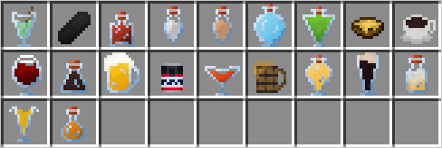

# Напитки

<figure><figcaption>
Все напитки сервера
</figcaption></figure>

## Варка напитков

Для успешного создания напитка вам нужно пройти через 3 этапа:



### Ферментация

Для этого этапа понадобится наполненный водой котёл, под которым будет костёр. \
Вам достаточно взять в руку нужный ингредиент и нажать ПКМ по котлу, тем самым положить ингредиент в котёл.

Ферментация требует определённого времени. Нажав ПКМ по котлу с часами в руках, можно узнать, сколько прошло времени.

Когда пройдёт необходимое количество минут, жидкость нужно собрать с помощью пустых бутылок



### Дистилляция

Для этого этапа понадобится зельеварка (огненный порошок в кач-ве топлива необязателен). \
В слот ингредиента зелья нужно положить светокаменную пыль, а в слот бутылок — жидкость, которую вы получили после ферментации.

Дистилляция проходит автоматически, так что за ней необязательно следить.



### Выдержка

Для этого этапа понадобится бочка. Некоторые напитки требуют специальную бочку, которую добавляет плагин. Построить её можно с помощью восьми лестниц. Лестницы нужно расставлять в форме крестика: два блока в ширину, высоту и глубину. Однако, можно использовать и ванильную бочку, она может вмещать до 6 бутылок и будет считаться за дубовую.

Чтобы выдержать напиток, нужно положить его в бочку и ожидать определённое количество времени по такой формуле: 1 год настаивания = 1 игровые сутки = 20 минут реального времени.



## Свойства напитков

У каждого напитка есть целый перечень свойств: качество, алкогольность и дополнительные эффекты.

### Качество

Качество определяется количеством звёздочек, которые отображаются в описании напитка в инвентаре.

Качество зависит от того, насколько правильно был сварен напиток. Если всё было сделано по рецепту — вы будете получать 5 звёзд.

Качество влияет на характеристики напитка: чем меньше качество напитка, тем хуже будут его характеристики.

### Алкогольность

Алкогольность отображается в описании напитка в инвентаре.&#x20;

Алкогольность влияет на то, насколько большое опьянение вы будете получать от напитка. Чем выше уровень опьянения, тем быстрее вы будете получать негативные эффекты.

Опьянение отображается над сытостью, пока игрок не будет полностью трезвым, а понижается с помощью времени, молока или хлеба.

<figure><figcaption>
Интерфейс опьянения
</figcaption></figure>

### Опьянение

От опьянения вы будете получать некоторые негативные эффекты:

* Более хаотичное и медленное передвижение;
* Эффект тошноты и слепоты;
* Рвота сгустками слизи;
* Неразборчивая речь в чате.

### Дополнительные эффекты

У некоторых напитков есть дополнительные эффекты в виде эффектов от ванильных зелий, например ночное зрение.
