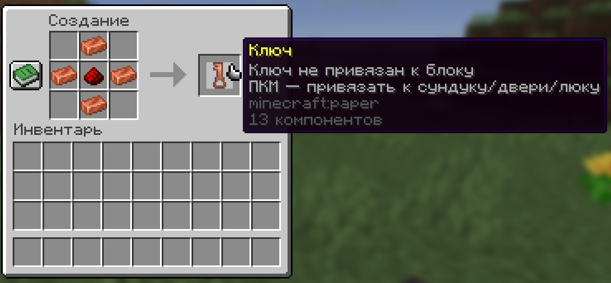
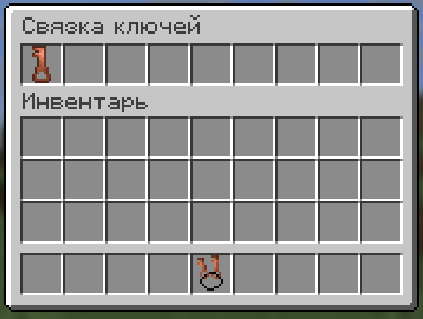

# Ключи

## Видео-демонстрация плагина



## Ключ

Новый предмет — Ключ. Ключ делается из 4-х медных слитков и 1-й редстоуновой пыли.

С помощью ключа вы можете **запирать сундуки, деревянные двери и деревянные люки**. Для этого нажмите ключом по блоку.\
Таким образом, с блоком можно будет взаимодействовать только с помощью ключа. Это может придать вашему дому немного приватности и безопасности.

Вы можете отпереть блок, нажав по нему Shift+ПКМ с ключом в руках.

<figure><figcaption>
Создание ключа
</figcaption></figure>

## Связка ключей

Связка ключей создаётся из 1-го медного слитка и 1-й нити.

Нажав Shift+ПКМ со связкой ключей в руках, у вас откроется меню, в которое вы сможете поместить свои привязанные ключи (до 9 шт.), а после пользоваться ими используя связку ключей.\
Таким образом, если у вас накопилось много ключей, их удобно можно хранить в связке.

<figure><figcaption>
Меню связки ключей
</figcaption></figure>
