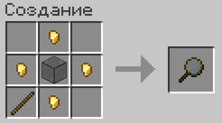
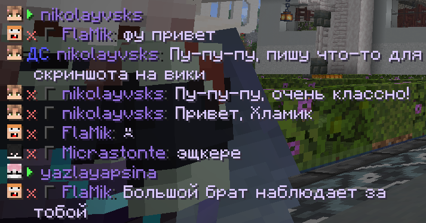
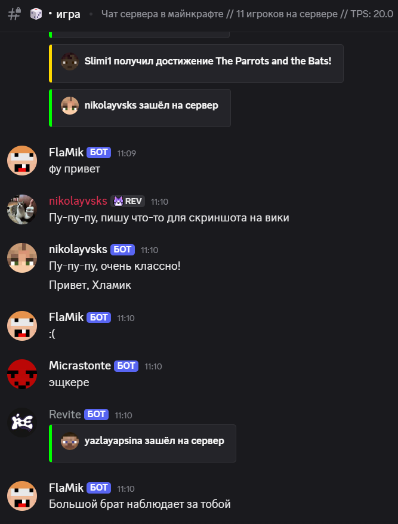
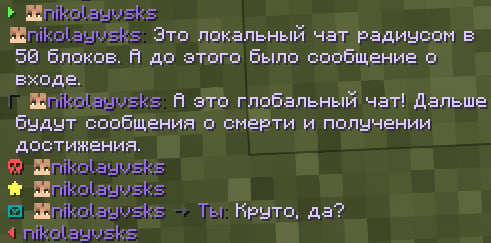
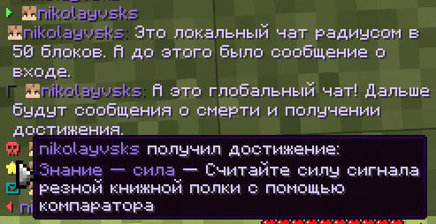
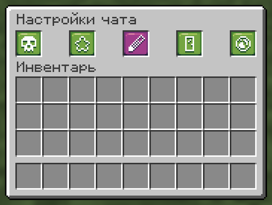
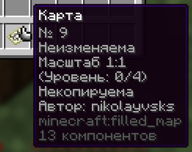
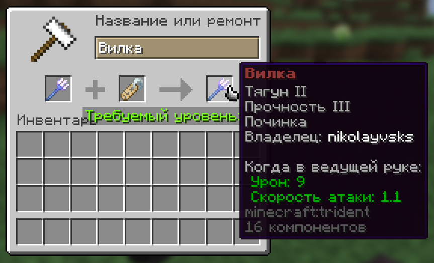

# Детективный дроп v4.1

## Новый предмет — детективная лупа

Обложите тонированное стекло золотыми самородками и нацепите всё это на палочку, чтобы получить детективную лупу

<figure><figcaption>
Создание детективной лупы
</figcaption></figure>

Детективная лупа позволит вам поддерживать порядок на своей базе: вы сможете просматривать взаимодействия игроков с блоками.

`ЛКМ` по блоку — кто ломал или ставил блок;

`ПКМ` по блоку — взаимодействия с хранилищем (к примеру, клал в сундук или брал из него);

`Shift+ПКМ` — постановки и поломки в радиусе 5 блоков.

<figure><figcaption>
Сообщения детективной лупы
</figcaption></figure>

Таким образом вы сможете отслеживать на своей базе нежелательные изменения и [обращаться с ними к модераторам](../info/help.md).

Отдельное спасибо `Wondarkus` за работу над моделью и текстурой детективной лупы.

## Новые текстуры напитков

Мы обновили текстуры большинства напитков и теперь у них новый вид — они не только стали разнообразнее, но теперь они ещё больше похожи на аналоги из реальной жизни.

<figure><figcaption>
Все напитки сервера
</figcaption></figure>

## Чат Minecraft в Discord для всех

В октябре мы добавили чат Minecraft в Discord для наших пушеров — можно не только просматривать глобальный чат в отдельном канале, но и писать прямо в майнкрафт.

Мы обещали открыть эту функцию для всех в ноябре. Собственно, этот момент настал: всем игрокам будет доступен чат Minecraft в Discord через канал #игра с первого ноября.

Подробнее про это можно прочитать [здесь](https://wiki.revitemc.com/gameplay/chat#sinkhronizaciya-s-discord).

<figure><figcaption>
Как это выглядит в Minecraft Сообщения из Discord помечаются префиксом ДС
</figcaption></figure> <figure><figcaption>
Как это выглядит в Discord
</figcaption></figure>

#### На этом контент дропа заканчивается. Он будет доступен на сервере с первого ноября.

#### Ниже представлен контент прошлого дропа (четвёртый сезон v4.0):

#### Новейшая версия

Сервер поддерживает новейшую версию `1.21.8`, а это значит, что с третьего сезона (`1.21`) появилась целая куча нововведений!

Пройдёмся вкратце:

* «Пробуждение сада» — новый биом бледного сада;
* «Весеннее пробуждение» — новые виды животных и растений;
* «Погоня за небесами» — счастливый гаст (на сервере мы его ускорили);
* Ну и конечно, многое другое...

<figure><figcaption></figcaption></figure>

#### Серьёзные потери

К сожалению, в этом сезоне мы были вынуждены отказаться от сезонов и банковской системы. Мы обязательно постараемся вернуть их в будущем!

#### Переработанный чат

Мы очень серьёзно поработали над видом и функционала нашего чата!

Во-первых, сам чат и большинство системных сообщений (смерти, достижения и др.) выполнены в едином и удобном стиле. Фокус делается на никнеймы и сообщения игроков, всё остальное скрыто за значками.

<figure><figcaption>
Сообщения в чате
</figcaption></figure> <figure><figcaption>
Наведитесь на значок достижения для информации
</figcaption></figure>

Во-вторых, мы сделали возможность настраивать чат под себя.\
С помощью /settings открываются настройки чата, где вы можете:

* Включить или выключить сообщения о смертях;
* Включить или выключить сообщения о достижениях;
* Включить или выключить сообщения о входах и выходах;
* Включить или выключить глобальный чат (писать в выключенный глобальный чат не получится);
* Выбрать цветовое оформление чата.

<figure><figcaption>
Настройки чата
</figcaption></figure> <figure><figcaption>
Выбор цвета чата
</figcaption></figure>

#### Ещё более красивые напитки

Мы продолжаем работу по улучшению наших напитков! На этот раз мы улучшили интерфейс опьянения.

Теперь он выполнен в ванильном стиле и отображается над строкой сытости в виде строки из бокалов вина. Пока вы не протрезвеете полностью, он не пропадет.

<figure><figcaption>
Интерфейс опьянения
</figcaption></figure>

#### Некопируемые карты

Эта функция уже была на сервере, но она изменилась.

Теперь, чтобы сделать карту некопируемой, достаточно взять в ведущую руку саму карту, а во вторую чернильный мешок. После этого вы нажимаете картой по столу картографа и она становится некопируемой с указанием автора.

<figure><figcaption>
Вид некопируемой карты
</figcaption></figure>

Если вы хотите сделать карту снова копируемой, достаточно взять перо вместо чернильного мешка и сделать то же самое (если вы автор карты, конечно).

#### Подписывание предметов

Зачаровываемые предметы можно подписать своим никнеймом, чтобы все знали кто является его владельцем.

Для этого соедините предмет с биркой наковальне и у него появится подпись. Чтобы её снять, соедините предмет с пером.

<figure><figcaption>
Подписывание предмета
</figcaption></figure>


Подписанные _разными_ игроками предметы **нельзя** соединить!

