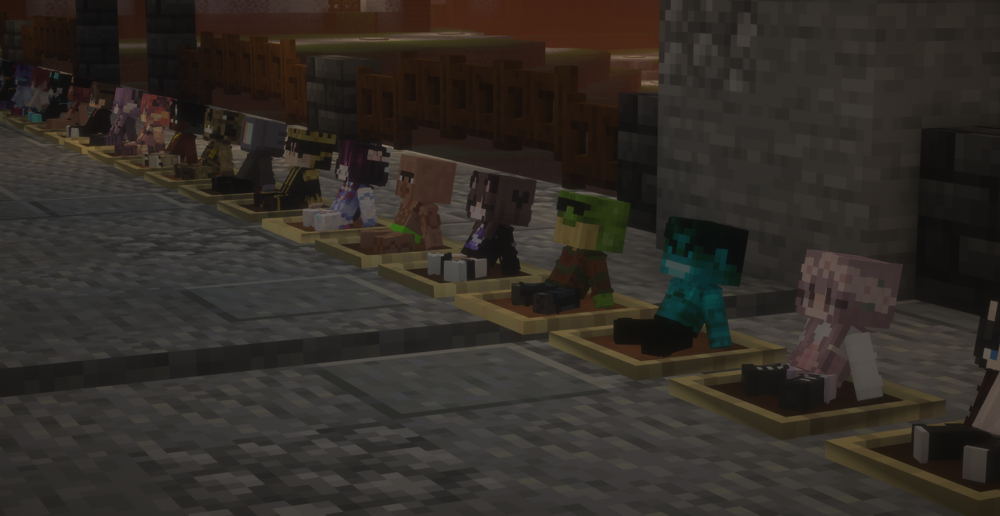

# Артефактный дроп v4.2

## Новые зачарования-артефакты

Мы добавили целый десяток новых зачарований-артефактов (дальше просто артефакты).&#x20;

Артефакты — новый, исключительно косметический вид зачарований. Их можно получить ровно как и другие наши зачарования, но работать они будут только у игроков с подпиской PUSH.

Артефакты выполняют одну простую цель — они создают эффекты (частицы) при использовании предмета, на который они наложены.

С работоспособностью и списком артефактов можно ознакомиться в [статье зачарований](enchants.md).

## Обновлённые куколки (и их список)

<figure><figcaption></figcaption></figure>

Мы поработали над куколками-тотемами пушеров.

Во-первых, мы наконец-то сделали [статью-список со всеми доступнами куклами пушеров](pushers.md).

Во-вторых, был добавилен дополнительный вариант куколки для декора (правильно сидит в рамке) — для этого в названии тотема перед никнеймом добавьте слово `Кукла`.

## Быстрое создание бетона

Теперь бетон на сервере можно сделать еще быстрее, чтобы было удобнее создавать постройки. Для этого достаточно скинуть сухой цемент в котёл с водой и он переделается в бетон.

#### Артефактный дроп будет доступен на сервере с 21 ноября.

### Ниже представлен контент предыдущего дропа (детективный дроп v4.1):

#### Новый предмет — детективная лупа

Обложите тонированное стекло золотыми самородками и нацепите всё это на палочку, чтобы получить детективную лупу

<figure><figcaption>
Создание детективной лупы
</figcaption></figure>

Детективная лупа позволит вам поддерживать порядок на своей базе: вы сможете просматривать взаимодействия игроков с блоками.

`ЛКМ` по блоку — кто ломал или ставил блок;

`ПКМ` по блоку — взаимодействия с хранилищем (к примеру, клал в сундук или брал из него);

`Shift+ПКМ` — постановки и поломки в радиусе 5 блоков.

<figure><figcaption>
Сообщения детективной лупы
</figcaption></figure>

Таким образом вы сможете отслеживать на своей базе нежелательные изменения и [обращаться с ними к модераторам](../info/help.md).

Отдельное спасибо `Wondarkus` за работу над моделью и текстурой детективной лупы.

#### Новые текстуры напитков

Мы обновили текстуры большинства напитков и теперь у них новый вид — они не только стали разнообразнее, но теперь они ещё больше похожи на аналоги из реальной жизни.

<figure><figcaption>
Все напитки сервера
</figcaption></figure>

#### Чат Minecraft в Discord для всех

В октябре мы добавили чат Minecraft в Discord для наших пушеров — можно не только просматривать глобальный чат в отдельном канале, но и писать прямо в майнкрафт.

Мы обещали открыть эту функцию для всех в ноябре. Собственно, этот момент настал: всем игрокам будет доступен чат Minecraft в Discord через канал #игра с первого ноября.

Подробнее про это можно прочитать [здесь](https://wiki.revitemc.com/gameplay/chat#sinkhronizaciya-s-discord).

<figure><figcaption>
Как это выглядит в Minecraft Сообщения из Discord помечаются префиксом ДС
</figcaption></figure> <figure><figcaption>
Как это выглядит в Discord
</figcaption></figure>

