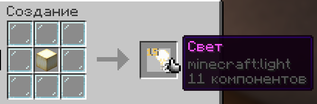

# Другое

## Форматирование в наковальне

### Название предмета

Название предмета можно не только менять, но и форматировать или менять его цвет. Для этого перед словом в наковальне нужно поставить `&[код]`. Мы составили таблицу с перечнем кодов:

<table><thead><tr><th width="257">Код</th><th>Что делает</th></tr></thead><tbody><tr><td><code>[hex-код]</code></td><td>Цвет <a href="https://g.co/kgs/sdK1nxz">hex-кода</a>, который вы указали. Например, <code>#ff0000</code> сделает ярко-красный цвет.</td></tr><tr><td><code>&#x26;0</code></td><td>Чёрный цвет</td></tr><tr><td><code>&#x26;1</code></td><td>Тёмно-синий цвет</td></tr><tr><td><code>&#x26;2</code></td><td>Тёмно-зелёный цвет</td></tr><tr><td><code>&#x26;3</code></td><td>Бирюзовый цвет</td></tr><tr><td><code>&#x26;4</code></td><td>Тёмно-красный цвет</td></tr><tr><td><code>&#x26;5</code></td><td>Тёмно-фиолетовый цвет</td></tr><tr><td><code>&#x26;6</code></td><td>Золотой цвет</td></tr><tr><td><code>&#x26;7</code></td><td>Серый цвет</td></tr><tr><td><code>&#x26;8</code></td><td>Тёмно-серый цвет</td></tr><tr><td><code>&#x26;9</code></td><td>Синий цвет</td></tr><tr><td><code>&#x26;a</code></td><td>Зелёный цвет</td></tr><tr><td><code>&#x26;b</code></td><td>Голубой цвет</td></tr><tr><td><code>&#x26;c</code></td><td>Красный цвет</td></tr><tr><td><code>&#x26;d</code></td><td>Фиолетовый цвет</td></tr><tr><td><code>&#x26;e</code></td><td>Жёлтый цвет</td></tr><tr><td><code>&#x26;f</code></td><td>Белый цвет</td></tr><tr><td><code>&#x26;k</code></td><td>Запутанный текст (неразбериха из разных символов)</td></tr><tr><td><code>&#x26;l</code></td><td>Жирный текст</td></tr><tr><td><code>&#x26;m</code></td><td>Зачёркнутый текст</td></tr><tr><td><code>&#x26;n</code></td><td>Подчёркнутый текст</td></tr><tr><td><code>&#x26;o</code></td><td>Курсивный текст <em>(буквы под наклоном)</em></td></tr><tr><td><code>&#x26;r</code></td><td>Сбрасывает любое форматирование</td></tr></tbody></table>

### Подписывание предмета

Зачаровываемые предметы можно подписать своим никнеймом, чтобы все знали кто является его владельцем.

Для этого соедините предмет с биркой наковальне и у него появится подпись. Чтобы её снять, соедините предмет с пером.

<figure><figcaption>
Подписывание предмета
</figcaption></figure>


Подписанные разными игроками предметы не получится соединить!


## Некопируемые карты

Чтобы сделать карту некопируемой, достаточно взять в ведущую руку саму карту, а во вторую чернильный мешок. После этого вы нажимаете картой по столу картографа и она становится некопируемой с указанием автора.

<figure><figcaption>
Некопируемая карта
</figcaption></figure>

Если вы хотите сделать карту снова копируемой, достаточно взять перо вместо чернильного мешка и сделать то же самое (если вы автор карты, конечно).

## Эмоции и позы

### Эмоции

На сервере стоит мод [**EmoteCraft**](https://modrinth.com/plugin/emotecraft/), который позволяет игрокам проигрывать различные эмоции. Его установка необязательна, но мы рекомендуем сделать это.\
_Также рекомендуем установить_ [_**BendableCuboids**_](https://modrinth.com/mod/bendable-cuboids/) _для сгибания конечностей во время эмоций._

Для проигрывания эмоций вам нужно установить их в `.minecraft/emotes`. Мы советуем поставить [**SPEmotes 3.0**](https://docs.google.com/document/d/1AK0w8M1_oZ3Z3VxoETT4QJ-OjVsP1AzqE0kHhSazymQ).

### Позы

С помощью команд вы можете принять различные позы, которые будут все видеть:

* `/sit` — сесть;
* `/lay` — лечь на спину;
* `/crawl` — лечь на живот (также можно ползать).

Также вы можете нажать ПКМ по игроку, чтобы сесть ему на голову.

## Скрытые никнеймы

На сервере скрыты никнеймы игроков над головами. Чтобы увидеть их, нажмите ПКМ по игроку и вам напишет его никнейм.

Также можно использовать мод [**LocatorHeads**](https://modrinth.com/mod/locator-heads/), чтобы просматривать никнеймы в локатор-баре.

## Пропуск ночи

Если во время ночи спит больше 33% игроков, ночь будет пропущена с красивой анимацией.

## Ускоренные гасты

Счастливые гасты ускорены в два раза, когда на них сидит игрок.

## Невидимые рамки

Нажав ножнциами по рамке, в которой уже есть предмет вы сделаете её невидимой. Если предмет убрать — рамка будет уничтожена.

## Создание блока света

Из 8 стеклянных панелей и 1 охристой, малахитовой или перламутровой квампы можно создать 8 блоков света.

<figure><figcaption>
Крафт блока света
</figcaption></figure>

## Быстрое убирание листвы

Листва со срубленных деревьев пропадает почти мгновенно.

## Авторизация

При использовании пиратского аккаунта, вам нужно будет авторизоваться (или зарегистрироваться, если входите впервые) на сервер. Если вы используете пиратский аккаунт, на ник которого зарегистрирована лицензия, вам нужно зайти 2 раза и вы будете использовать пиратскую авторизацию.

Если вы используете лицензию, авторизация будет происходить автоматически.

## Скины

На сервере можно менять скины прямо в игре, через `/skin url "[ссылка]" slim/classic`. Для установки скина нужна ссылка на него. Самый простой способ получить её — скинуть развёртку скина в любой канал Discord, нажать по нему ПКМ и в контекстом меню выбрать `Копировать ссылку`. Также после ссылки нужно выбрать толщину рук: `slim` — тонкие (модель алекс), `classic` — толстые (модель стива). Скины можно устанавливать в т.ч. и с пиратскими аккаунтами, видеть их будут все.
