---
layout:
  width: default
  title:
    visible: true
  description:
    visible: false
  tableOfContents:
    visible: true
  outline:
    visible: true
  pagination:
    visible: true
  metadata:
    visible: true
---

# Куколки Пушеров

На сервере можно получить куколки некоторых игроков, а именно наших пушеров — людей, которые помогают серверу жить и процветать.

Чтобы получить куколку, вам нужно переименовать тотем в никнейм игрока (список ниже). Если вам нужен вариант для декора (для рамки) — добавьте перед никнейм слово `Кукла`.

<figure><figcaption>
<code>_bobrilo_</code>
</figcaption></figure> <figure><figcaption>
<code>_Creeper_Boom</code>
</figcaption></figure> <figure>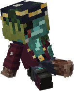<figcaption>
<code>_Rokmaks_</code>
</figcaption></figure> <figure>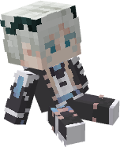<figcaption>
<code>Astart_</code>
</figcaption></figure>

<figure>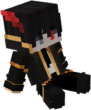<figcaption>
<code>BlackDrkonchic</code>
</figcaption></figure> <figure>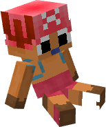<figcaption>
<code>Cho55a</code>
</figcaption></figure> <figure>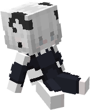<figcaption>
<code>Cupcoffee31</code>
</figcaption></figure> <figure>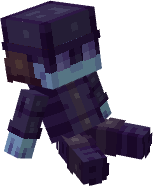<figcaption>
<code>Dagonis</code>
</figcaption></figure>

<figure>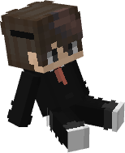<figcaption>
<code>Darwin_144</code>
</figcaption></figure> <figure>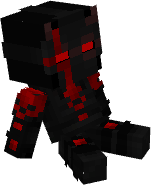<figcaption>
<code>DedanYT</code>
</figcaption></figure> <figure>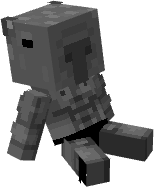<figcaption>
<code>Deki0</code>
</figcaption></figure> <figure>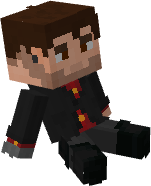<figcaption>
<code>Deyson</code>
</figcaption></figure>

<figure>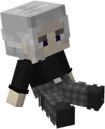<figcaption>
<code>DinoCk</code>
</figcaption></figure> <figure>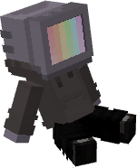<figcaption>
<code>fexoa</code>
</figcaption></figure> <figure>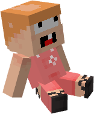<figcaption>
<code>FlaMik</code>
</figcaption></figure> <figure>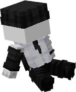<figcaption>
<code>Hagune_</code>
</figcaption></figure>

<figure>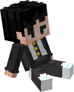<figcaption>
<code>Hith4m</code>
</figcaption></figure> <figure>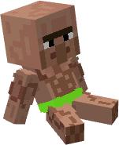<figcaption>
<code>Joel2033</code>
</figcaption></figure> <figure>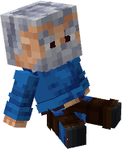<figcaption>
<code>Kankarto</code>
</figcaption></figure> <figure>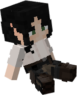<figcaption>
<code>KiseL_OK1</code>
</figcaption></figure>

<figure>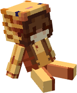<figcaption>
<code>kremka</code>
</figcaption></figure> <figure>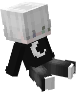<figcaption>
<code>Lo3eV</code>
</figcaption></figure> <figure>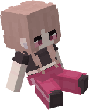<figcaption>
<code>meumew</code>
</figcaption></figure> <figure>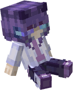<figcaption>
<code>miamoraxx</code>
</figcaption></figure>

<figure>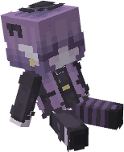<figcaption>
<code>Morasakibara</code>
</figcaption></figure> <figure>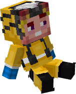<figcaption>
<code>Mr_Kotic</code>
</figcaption></figure> <figure>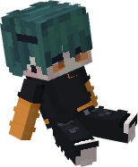<figcaption>
<code>neyann</code>
</figcaption></figure>

<figure>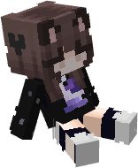<figcaption>
<code>Nezuko_Chan0897</code>
</figcaption></figure> <figure>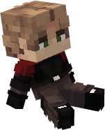<figcaption>
<code>nikolayvsks</code>
</figcaption></figure> <figure>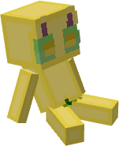<figcaption>
<code>NoName4uwU</code>
</figcaption></figure> <figure>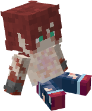<figcaption>
<code>nVnENT0</code>
</figcaption></figure>

<figure>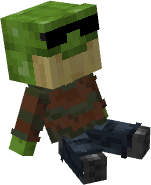<figcaption>
<code>PABLOSOK</code>
</figcaption></figure> <figure>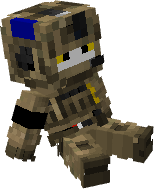<figcaption>
<code>PaHeMka</code>
</figcaption></figure> <figure>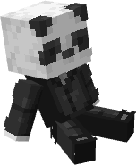<figcaption>
<code>panda6001</code>
</figcaption></figure> <figure>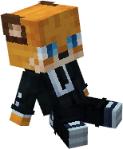<figcaption>
<code>ReynBly</code>
</figcaption></figure>

<figure>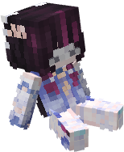<figcaption>
<code>Romenskayya</code>
</figcaption></figure> <figure>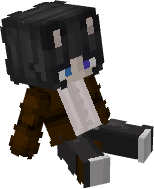<figcaption>
<code>sitvi</code>
</figcaption></figure> <figure>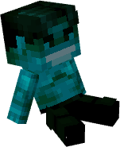<figcaption>
<code>sosica2</code>
</figcaption></figure> <figure>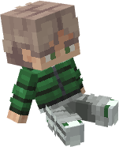<figcaption>
<code>steparikov</code>
</figcaption></figure>

<figure>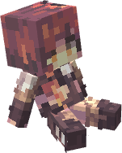<figcaption>
<code>Tea</code>
</figcaption></figure> <figure>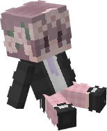<figcaption>
<code>Terryk</code>
</figcaption></figure> <figure>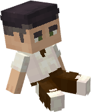<figcaption>
<code>TheFoxses</code>
</figcaption></figure> <figure>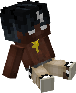<figcaption>
<code>tipochek_</code>
</figcaption></figure>

<figure>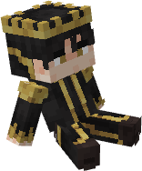<figcaption>
<code>TitledBrick</code>
</figcaption></figure> <figure>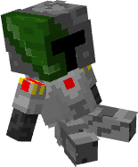<figcaption>
<code>Varadem</code>
</figcaption></figure> <figure>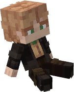<figcaption>
<code>Venia_Smurf_</code>
</figcaption></figure>

<figure>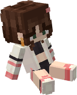<figcaption>
<code>vextraj</code>
</figcaption></figure> <figure>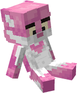<figcaption>
<code>Wondarkus</code>
</figcaption></figure> <figure>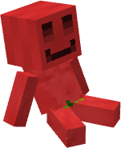<figcaption>
<code>Wordless_</code>
</figcaption></figure> <figure>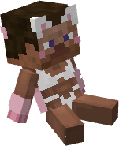<figcaption>
<code>xKonigsberg</code>
</figcaption></figure>

<figure>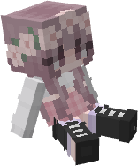<figcaption>
<code>yazlayapsina</code>
</figcaption></figure> <figure>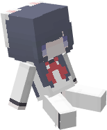<figcaption>
<code>zxreff</code>
</figcaption></figure>

<figure><figcaption>
<code>Stepan</code>
</figcaption></figure> <figure><figcaption>
<code>KOMKOVaaa</code>
</figcaption></figure> <figure><figcaption>
<code>TheCrazyDed</code>
</figcaption></figure> <figure><figcaption>
<code>vadimak10</code>
</figcaption></figure>

<figure><figcaption>
<code>Pronuya</code>
</figcaption></figure> <figure><figcaption>
<code>renjoke_</code>
</figcaption></figure> <figure><figcaption>
<code>Gardonit</code>
</figcaption></figure> <figure><figcaption>
<code>LaymTea</code>
</figcaption></figure>

Список куколок актуален на 27-е ноября (будет обновляться).
