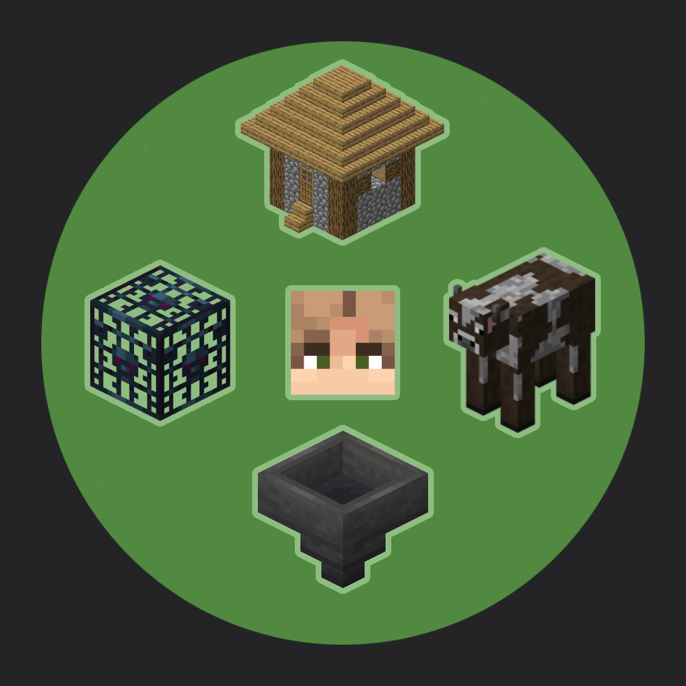
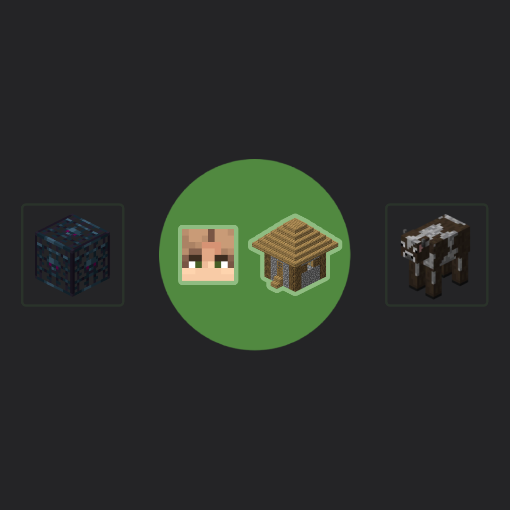

---
layout:
  width: default
  title:
    visible: true
  description:
    visible: false
  tableOfContents:
    visible: true
  outline:
    visible: true
  pagination:
    visible: true
  metadata:
    visible: true
---

# Постройка ферм

Прежде всего, обозначим важный момент: эта статья — не принуждение и не правило, вас никто не заставляет следовать тому, что здесь написано.

Но мы настоятельно просим прислушаться к содержанию этой статьи, ведь то, как вы строите свои базы и фермы очень сильно влияет на нагрузку сервера. Если вы хотите помочь нам в поддержании стабильной работы сервера — можете начать именно с того, что написано в этой статье.

## Общественные фермы

На сервере активно развивается система общественных ферм.

Гильдия строителей и игроки выстраивают по всему серверу продвинутые фермы, которыми могут пользоваться абсолютно все игроки (в рамках правил конкретной фермы). Перед тем, как начать постройку своей фермы, подумайте хорошенько: а стоит ли вообще строить свою личную ферму? Ведь скорее-всего вам хватит общественной фермы, если таковая есть.

Если вы хорошо знаете механики игры и можете помочь в постройке ферм — будем рады видеть вашу заявку в гильдию строителей. Также, если у вас есть идея для постройки общественной фермы, которой ещё нет — вы тоже можете её предлагать гильдии строителей.

### Список доступных общественных ферм:

**\[пока работаем над ними 😉]**

## Соблюдайте расстояние

Если вы всё-таки решили строить свои личные фермы, постарайтесь соблюдать важное правило: **стройте фермы на значительном расстоянии от своей базы, от городов, от других ферм и прочих прогружаемых игроками территорий.**

Ведь если размещать фермы кучей в популярных местах, они будут **постоянно** нагружать сервер независимо от того, пользуется ими кто-то на данный момент или нет, что создаёт лишнюю нагрузку на сервер.

<figure><figcaption>
<mark style="color:$danger;">Это плохо</mark> ❌ Фермы расположены кучей на базе игрока и постоянно прогружаются, нагружая сервер
</figcaption></figure> <figure><figcaption>
<mark style="color:$success;">Это хорошо ✅</mark> База и фермы расположены отдельно друг от друга и не прогружаются без необходимости, не создавая лишнюю нагрузку
</figcaption></figure>

